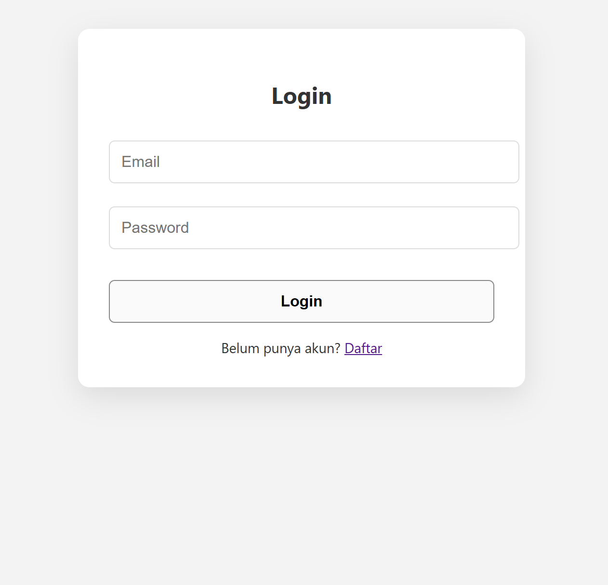
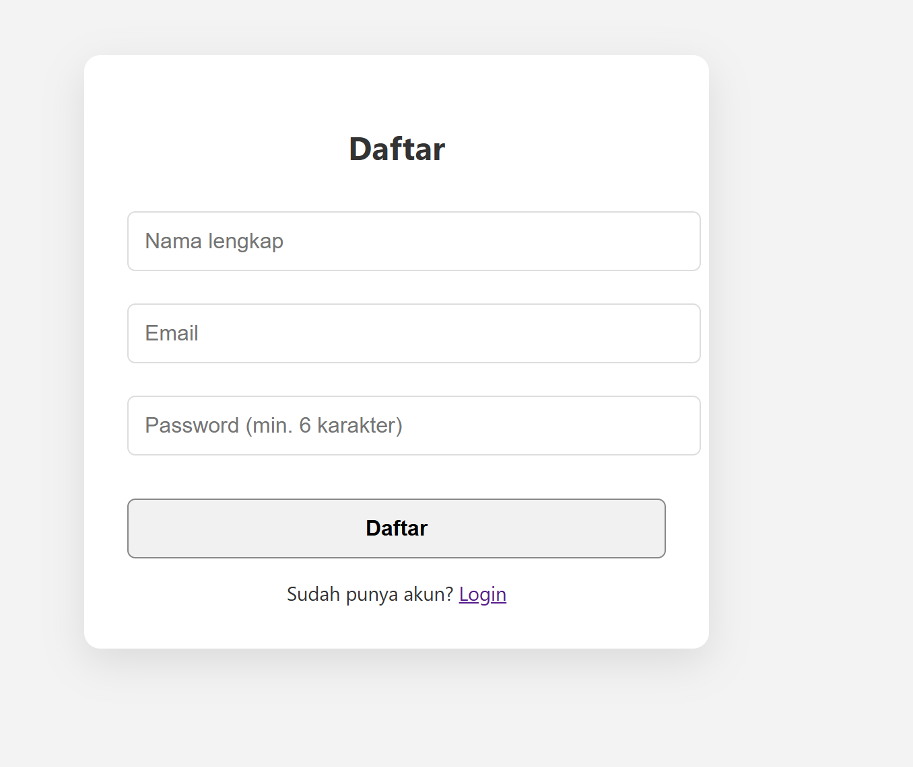
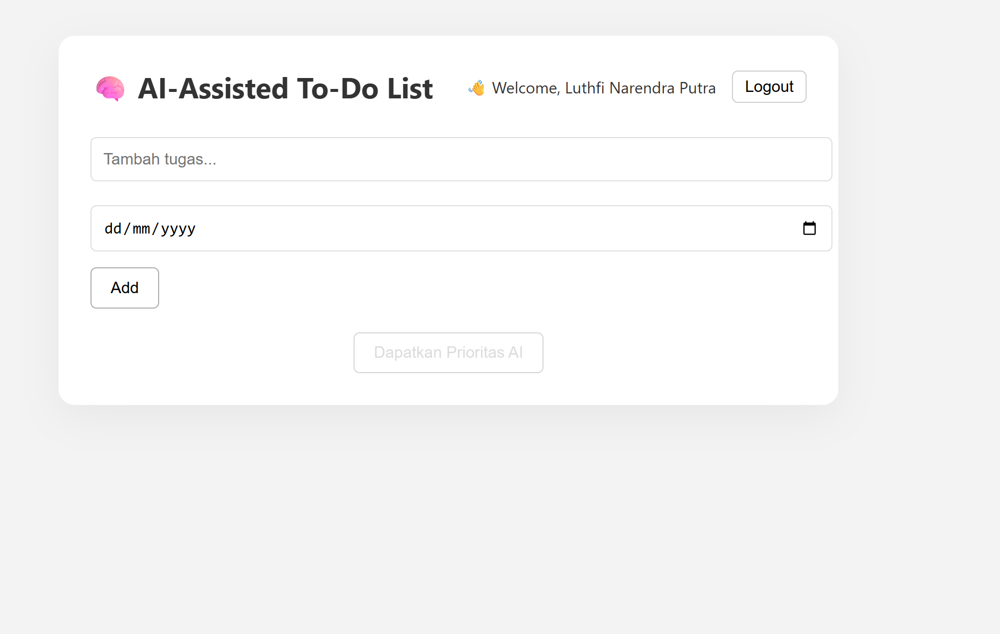

# 🧠 AI‑Assisted To‑Do List

Aplikasi web modern yang membantu pengguna menyusun **prioritas tugas** secara otomatis menggunakan bantuan **AI (mock)**, serta menyediakan fitur **login**, **edit**, **deadline**, dan **UI responsif**.

---

## 🚀 Fitur Utama

- ✅ Tambah & hapus tugas
- 📝 Edit tugas secara langsung
- 📅 Tambah deadline (tenggat waktu)
- 💾 Simpan data otomatis di `localStorage`
- 🔐 Login & register dengan **Firebase Authentication**
- 🧠 Rekomendasi prioritas tugas oleh AI (mock di production)
- 🔁 Mode mock (tanpa API key) siap digunakan di Replit
- 🌈 UI minimalis, bersih, dan mobile-friendly

---

## 🛠️ Teknologi yang Digunakan

| Layer       | Teknologi                               |
|-------------|-----------------------------------------|
| Frontend    | React, React Router DOM, CSS            |
| Backend     | Node.js, Express                        |
| AI/Mock     | Prioritas AI (Mock), OpenAI (opsional)  |
| Auth        | Firebase Authentication                 |
| Storage     | `localStorage` (Browser)                |
| Deployment  | Vercel (Frontend), Replit (Backend)     |

---

## 🌐 Demo Online

- **Frontend (Vercel)**  
  🔗 [todo-ai-assistanttt.vercel.app](https://todo-ai-assistanttt.vercel.app)

- **Backend (Replit / Mock)**  
  🔗 [Replit Mock Server](https://07716fe9-a80c-4b00-88db-9feb1aaa2040-00-2fcnl99pu1tk9.pike.replit.dev)

---

## 🧪 Contoh Output Prioritas (Mock)

```json
[
  { "task": "Tidur", "priority": 1 },
  { "task": "Belajar", "priority": 2 },
  { "task": "Mandi", "priority": 3 }
]
```
### 💻 Cara Menjalankan Secara Lokal

### 1. Clone Project
```bash
git clone https://github.com/Lutfinarendra/todo-ai-assistanttt.git
cd todo-ai-assistanttt
```

### 📦 2. Install Dependency

```bash
npm install
cd server
npm install
```

### 🔐 3. Atur API Key (Opsional)

Buat file `.env` di folder `server/`:

```
OPENAI_API_KEY=REMOVED_API_KEYxxxxx
PORT=4000
NODE_ENV=development
```

> Jika tidak mengisi API key, backend akan otomatis gunakan mode mock.

---

### ▶️ 4. Jalankan Aplikasi

**Terminal 1 (backend):**

```bash
cd server
npm start
```

**Terminal 2 (frontend):**

```bash
cd client
npm start
```

## 📸 Screenshot (Opsional)

*Tambahkan tampilan UI project :*

)))


```

```
## 🔐 Firebase Authentication Setup
Tambahkan file firebase.js di dalam client/src/:
```bash
import { initializeApp } from "firebase/app";
import { getAuth } from "firebase/auth";

const firebaseConfig = {
  apiKey: "YOUR_API_KEY",
  authDomain: "YOUR_PROJECT.firebaseapp.com",
  projectId: "YOUR_PROJECT_ID",
  storageBucket: "YOUR_PROJECT.appspot.com",
  messagingSenderId: "SENDER_ID",
  appId: "APP_ID"
};

const app = initializeApp(firebaseConfig);
export const auth = getAuth(app);
```


```
✨ Deployment
1. ✅ Frontend (Vercel)
- Deploy folder: client/
- Root Directory: client
- Build Command: npm run build
- Output Directory: build
Tambahkan environment variable:

```bash
REACT_APP_API_URL=https://your-backend.replit.dev
```
...
2. ✅ Backend (Replit)
- Upload file index.js, package.json, dan file .env jika perlu.
- Tambahkan file .replit:

```bash
 [deployment]
run = ["npm", "start"]
deploymentTarget = "autoscale"
ignorePorts = false

[[ports]]
localPort = 3000
externalPort = 80


## 🧠 Mode AI vs Mock
| Mode        | Deskripsi                                     |
| ----------- | --------------------------------------------- |
| Development | Bisa menggunakan OpenAI API Key               |
| Production  | Otomatis menggunakan mock AI (acak & efisien) |

---

## 📄 Lisensi

MIT License – Bebas digunakan, dimodifikasi, dan disebarluaskan.

---

## 📬 Kontak

Made with  by [@Lutfinarendra](https://github.com/Lutfinarendra)
